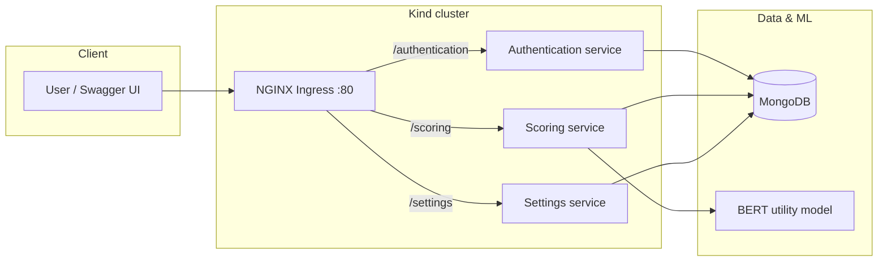
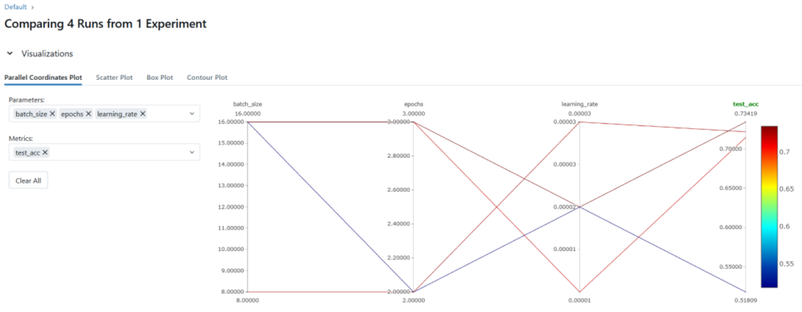

# SaaS Platform for Utility Scoring

*December 2024*

A cloud-native SaaS that scores free-text scenarios on **utilitarian** ethical grounds. Users authenticate, submit scenarios, and receive a continuous utility score from a fine-tuned BERT model; scores and history are stored per user in MongoDB. The system is split into three FastAPI microservices, containerized with Docker, and orchestrated on Kubernetes (Kind for local development).


---

## Overview

| | |
|---|---|
| **Problem** | Automated ethical reasoning is needed when evaluating user-written scenarios (e.g. alignment checks, decision support). |
| **Approach** | Fine-tune `bert-base-uncased` on paired better/worse scenarios from the [MetaEval utilitarianism dataset](https://github.com/metaeval/utilitarianism-dataset); deploy the best run for inference via REST. |
| **Delivery** | Three microservices behind NGINX Ingress on a Kind cluster; Swagger UI as the API frontend. |

Possible extensions (not implemented): score explanations, more ethical alternatives, integration with generative-AI alignment pipelines, centralized auth, CI/CD, and model-drift monitoring.

---

## Architecture



| Service | Role |
|---------|------|
| **Authentication** | Signup, login, session cookies; stores user credentials. |
| **Scoring** | Loads the MLflow-exported model, computes utility score, persists scenario + score. |
| **Settings** | View scoring history, change password, delete account. |

**Operations:** Each service runs as a Kubernetes Deployment with **3 replicas**. Ingress path prefixes are defined in `kubernetes/microservices-ingress.yaml`. The scoring pod requests more CPU/memory than auth/settings (see `kubernetes/scoring-app.yaml`).

**Database:** MongoDB holds users, sessions (via application logic), and per-user scenario history with scores.

---

## Model & evaluation

- **Base model:** `bert-base-uncased` (Hugging Face Transformers).
- **Training data:** [metaeval/utilitarianism](https://huggingface.co/datasets/metaeval/utilitarianism) — scenarios tokenized as even/odd pairs; training minimizes binary cross-entropy on pairwise “better vs worse” logits.
- **Tracking:** [MLflow](https://mlflow.org/) logs hyperparameters, train/test accuracy, and versioned PyTorch artifacts under `fine-tuning/mlruns/`.
- **Deployed artifact:** `microservices/scoring/model/` (exported from the best experiment).

### Hyperparameter search (summary)

| Learning rate | Batch size | Best test accuracy (epoch) |
|---------------|------------|----------------------------|
| 2e-5 | 16 | **73.4%** (epoch 3) — deployed |
| 3e-5 | 8 | 72.9% |
| 1e-5 | 16 | 72.9% |
| 2e-5 | 16 | 51.8% (under-trained / early run) |

The best configuration (batch size 16, learning rate `2e-5`) matches the analysis in the project report.

### MLflow visualization



Training code: `fine-tuning/training.py`, `fine-tuning/main.py`, `fine-tuning/data_utils.py`.

---

## Tech stack

| Layer | Technologies |
|-------|----------------|
| APIs | FastAPI, Pydantic, session cookies |
| ML | PyTorch, Transformers, MLflow |
| Data | MongoDB |
| Runtime | Docker |
| Orchestration | Kubernetes (Kind), NGINX Ingress |
| Process | GitFlow (`main`, `dev`, feature branches) |

---

## Repository structure

```
├── microservices/
│   ├── authentication/   # Signup, login
│   ├── scoring/          # Inference + model artifact
│   └── settings/         # History, password, account deletion
├── kubernetes/           # Deployments, services, ingress, Kind config
├── fine-tuning/          # Training pipeline + MLflow runs
├── deploy.sh             # Local Kind + build + deploy
└── docs/
    └── figures/          # README images (export from report)
```

---

## API at a glance

**Score a scenario** (after login on the scoring service):

```json
POST /utility_score
{ "scenario": "A scenario description here." }
```

```json
{
  "Scenario": "A scenario description here.",
  "Utility Score": 3.987
}
```

---

## Design decisions & limitations

**Decisions**

- **Microservices** isolate lightweight auth/settings from CPU-heavy BERT inference and allow independent scaling (e.g. scoring pods at 500m–1000m CPU).
- **MongoDB** fits variable user and history documents without rigid schema migrations.
- **Kind + Ingress** gives a production-like path on a single machine (host port 80 → cluster ingress).

**Limitations**

- Session auth is **per service**, not centralized JWT/SSO.
- No CI/CD or production monitoring (Evidently, Azure Monitor, etc.) in-repo.
- Model accuracy (~73% test) and inference cost could be improved with distillation, quantization, or GPU nodes.
- Sustainability optimizations (auto-scaling policies, CodeCarbon, region selection) are discussed in the report but not fully implemented.

**Future work:** explanations for scores, ethical alternatives, unified auth, automated pipelines, drift monitoring.
