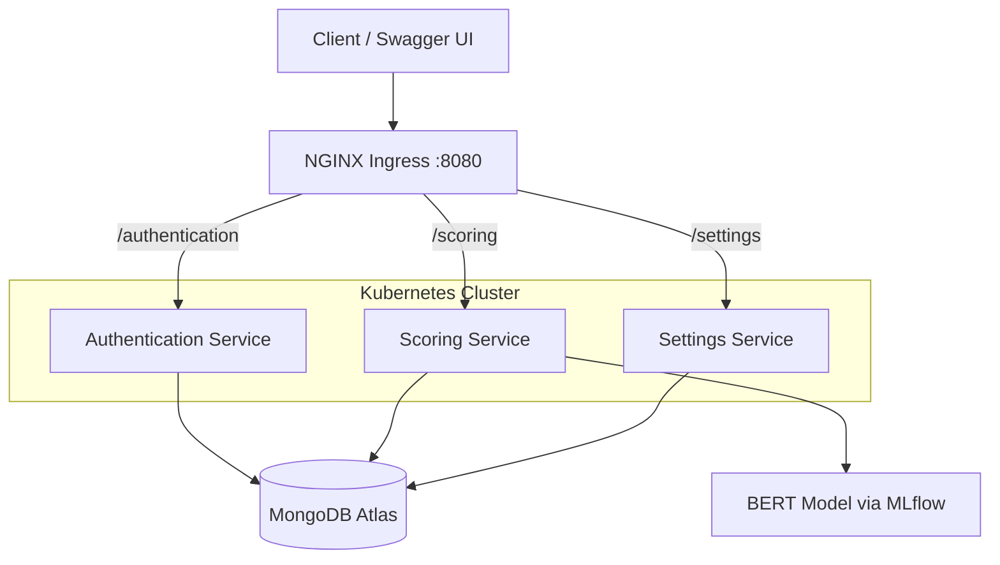

# Utility Scoring SaaS Platform

A cloud-native SaaS platform that scores ethical scenarios on a utilitarian scale using a fine-tuned BERT model. The system is built as three FastAPI microservices, deployed on Kubernetes (Kind) behind an NGINX Ingress controller, with MongoDB for persistence and MLflow for model lifecycle management.

**Author:** Mateo Marthoz

---

## Overview

Users sign up and log in through a dedicated authentication service. The scoring service runs inference on free-text scenarios and returns a continuous utility score. The settings service lets authenticated users view their score history, change their password, or delete their account. Session cookies tie requests across services to a single user identity.

The underlying model is **BERT-base-uncased**, fine-tuned on the [metaeval/utilitarianism](https://huggingface.co/datasets/metaeval/utilitarianism) dataset using pairwise ranking loss. Trained weights are packaged with MLflow and served from the scoring microservice.

---

## Architecture



| Component | Role |
|-----------|------|
| **Authentication** | User signup and login; session cookie creation |
| **Scoring** | BERT inference on scenarios; persists scores per user |
| **Settings** | Score history, password change, account deletion |
| **Ingress** | Path-based routing with prefix stripping |
| **MongoDB** | Users and score history |

Each microservice runs **3 replicas** in Kubernetes for availability.

---

## Tech Stack

| Layer | Technologies |
|-------|----------------|
| **API** | FastAPI, Pydantic, fastapi-sessions |
| **ML** | PyTorch, Hugging Face Transformers, MLflow |
| **Data** | MongoDB (PyMongo), Hugging Face Datasets |
| **Infrastructure** | Docker, Kubernetes (Kind), NGINX Ingress |
| **Model** | `bert-base-uncased` — sequence classification, ~72% pairwise test accuracy |

---

## Prerequisites

- **Linux** host (deployment script targets Debian/Ubuntu)
- **Port 80** free on the host (NGINX Ingress Controller)
- **`sudo`** privileges
- A **MongoDB** connection string (e.g. MongoDB Atlas)
- **Docker**, **kubectl**, and **Kind** — installed automatically by `deploy.sh` if missing

---

## Quick Start

### 1. Configure environment

Create a `.env` file in the project root:

```env
SECRET_KEY=your_secret_key_for_session_cookies
MONGO_URI=your_mongodb_connection_string
```

`deploy.sh` copies this file into each microservice before building images.

### 2. Deploy

```bash
sudo ./deploy.sh
```

The script will:

1. Create a Kind cluster (`mycluster`)
2. Deploy the NGINX Ingress Controller
3. Build and load Docker images for all three services
4. Apply Kubernetes deployments and ingress rules
5. Port-forward the ingress controller to **localhost:8080**

Keep the terminal open while using the platform — port-forwarding runs in the foreground.

### 3. Explore the API

| Service | Swagger UI |
|---------|------------|
| Authentication | http://localhost:8080/authentication/docs |
| Scoring | http://localhost:8080/scoring/docs |
| Settings | http://localhost:8080/settings/docs |

**Typical flow:** sign up → log in (on any service) → score scenarios → view history in Settings.

---

## API Reference

### Authentication (`/authentication`)

| Method | Endpoint | Description |
|--------|----------|-------------|
| `POST` | `/signup` | Register a new user |
| `POST` | `/login` | Authenticate and receive a session cookie |

**Signup request:**

```json
{
  "username": "test_user",
  "password": "test_password"
}
```

**Signup response:**

```json
{
  "message": "User created successfully"
}
```

### Scoring (`/scoring`)

| Method | Endpoint | Auth | Description |
|--------|----------|------|-------------|
| `POST` | `/login` | — | Obtain session cookie |
| `POST` | `/utility_score` | Cookie | Score a scenario |

**Score request:**

```json
{
  "scenario": "A scenario description here."
}
```

**Score response:**

```json
{
  "Scenario": "A scenario description here.",
  "Utility Score": 3.987
}
```

### Settings (`/settings`)

| Method | Endpoint | Auth | Description |
|--------|----------|------|-------------|
| `POST` | `/login` | — | Obtain session cookie |
| `GET` | `/history` | Cookie | List past scores for the current user |
| `PUT` | `/change-password` | Cookie | Update password (`new_password` query param) |
| `DELETE` | `/delete-account` | Cookie | Remove user and all associated scores |

---

## Fine-Tuning the Model

Training code lives in `fine-tuning/`. It loads `metaeval/utilitarianism`, fine-tunes BERT with a pairwise ranking objective, and logs metrics and artifacts to MLflow.

```bash
cd fine-tuning
pip install -r requirements.txt

python main.py \
  --nepochs 3 \
  --batch_size 32 \
  --learning_rate 2e-5
```

After training, copy the logged model artifact into the scoring service:

```
fine-tuning/mlruns/<run_id>/artifacts/model/  →  microservices/scoring/model/
```

Rebuild the scoring Docker image and redeploy for the new weights to take effect.

---

## Project Structure

```
├── deploy.sh                    # End-to-end Kind + K8s deployment
├── kubernetes/
│   ├── cluster-config.yml       # Kind cluster configuration
│   ├── deploy.yaml              # NGINX Ingress Controller
│   ├── authentication-app.yaml
│   ├── scoring-app.yaml
│   ├── settings-app.yaml
│   └── microservices-ingress.yaml
├── microservices/
│   ├── authentication/          # Signup & login
│   ├── scoring/                 # BERT inference + score storage
│   │   └── model/               # MLflow-packaged weights
│   └── settings/                # History, password, account management
└── fine-tuning/
    ├── main.py                  # Training entry point
    ├── training.py              # Train / evaluate loops
    ├── data_utils.py            # Dataset loading & tokenization
    └── load_model.py            # Model & optimizer setup
```

---

## Development Notes

- **Sessions** are shared across services via a common `SECRET_KEY` and cookie backend in `shared/session_manager.py`.
- **Scoring** runs inference on CPU by default (`map_location="cpu"` in `load_model.py`).
- **Ingress** strips path prefixes (`/authentication`, `/scoring`, `/settings`) before forwarding to each service — FastAPI routes are defined without those prefixes.
- Ensure **port 80** is not in use before deploying; the ingress controller binds to it inside the cluster.

---

## Coursework

Developed as part of **5CCSACCA** (Advanced Cloud Computing Architecture), King's College London.
